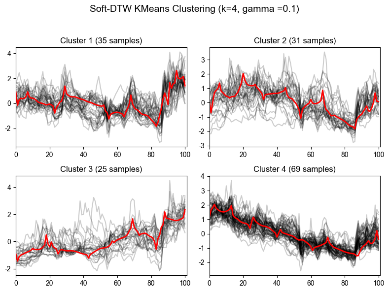
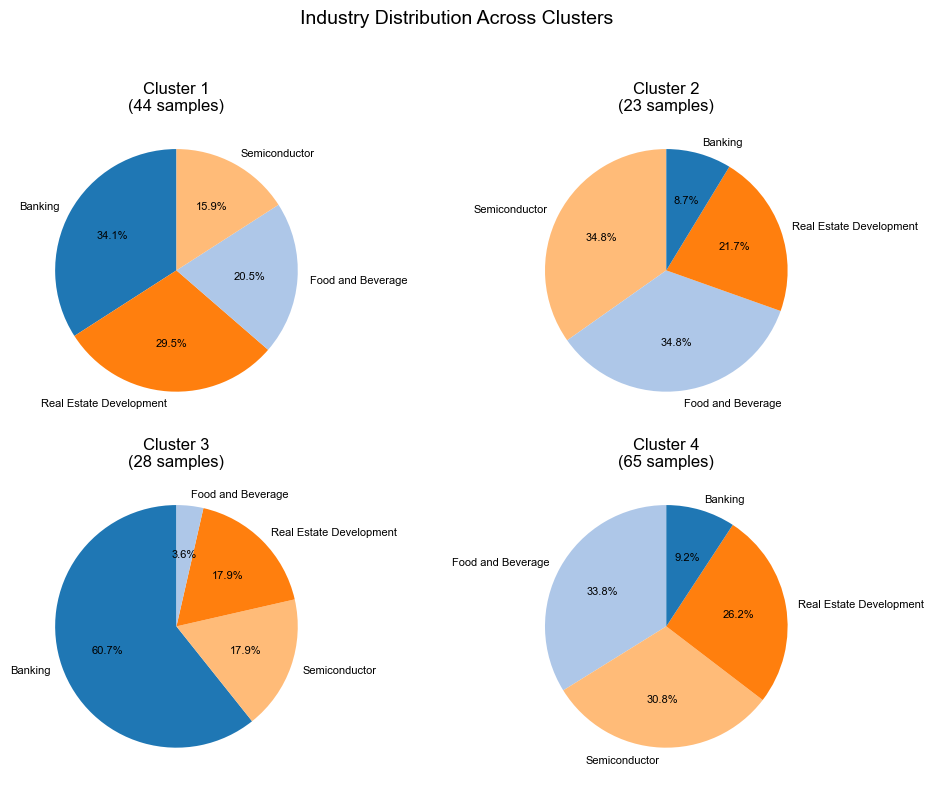
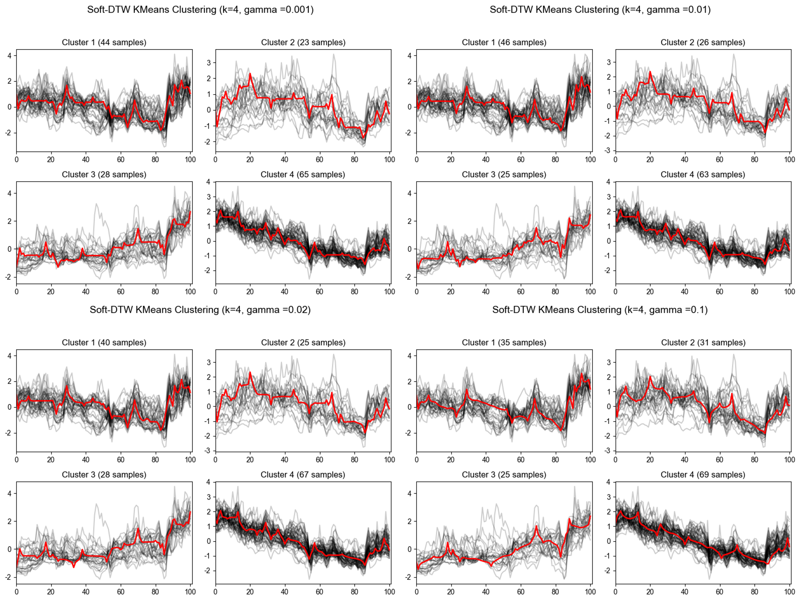

# Time-Series Clustering with DTW and Soft-DTW

A project on applying Dynamic Time Warping (DTW) and Soft-DTW to cluster financial time-series data from the Chinese A-share market.

## Overview

This project explores how DTW-based alignment methods can improve clustering for financial time-series data with temporal misalignment, nonlinear dynamics, and noise.

Using weekly closing price data from Chinese A-share stocks across four sectors — Semiconductors, Banking, Real Estate Development, and Food & Beverage — I built a Soft-DTW-based clustering pipeline and compared different smoothing parameters to identify the best-performing setting.

## Dataset

- Market: Chinese A-share stocks
- Sectors: Semiconductors, Banking, Real Estate Development, Food & Beverage
- Frequency: Weekly closing prices
- Period: 2023–2025
- Data sources: Baostock and AKShare

## Methodology

- Cleaned and standardized weekly stock price series
- Applied Soft-DTW-based K-means clustering
- Set number of clusters to k = 4
- Compared smoothing parameters: 0.001, 0.01, 0.02, 0.1
- Evaluated clustering quality with:
  - Silhouette Score
  - WSS (Within-Cluster Sum of Squares)
  - Davies–Bouldin Index (DBI)

## Results

The best clustering performance was achieved at γ = 0.1.

Main findings:
- Soft-DTW produced robust and interpretable clusters
- Banking stocks showed relatively strong internal consistency
- Semiconductor stocks exhibited greater heterogeneity
- Some clusters reflected sector concentration, while others captured cross-sector temporal similarities
## Figures

### Soft-DTW Clustering Result (γ = 0.1)

### Sector Distribution Under γ = 0.1

### Comparison Across Different γ Values

### DTW Illustration

## Report

[Project Thesis PDF](thesis.pdf.pdf)
## Tech Stack

Python, DTW, Soft-DTW, K-means, AKShare, Baostock, pandas, NumPy, matplotlib

## Author

Zeyu Gu
